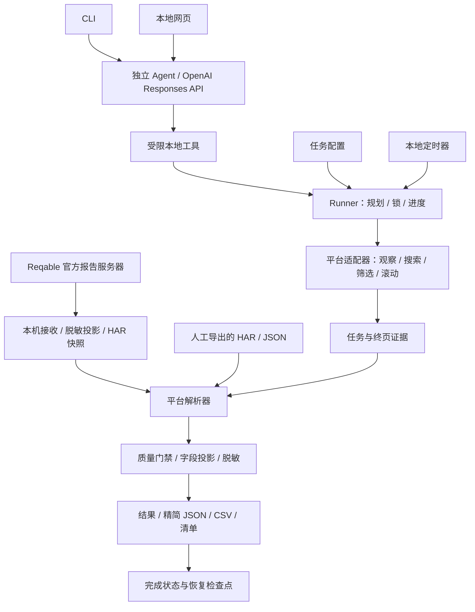
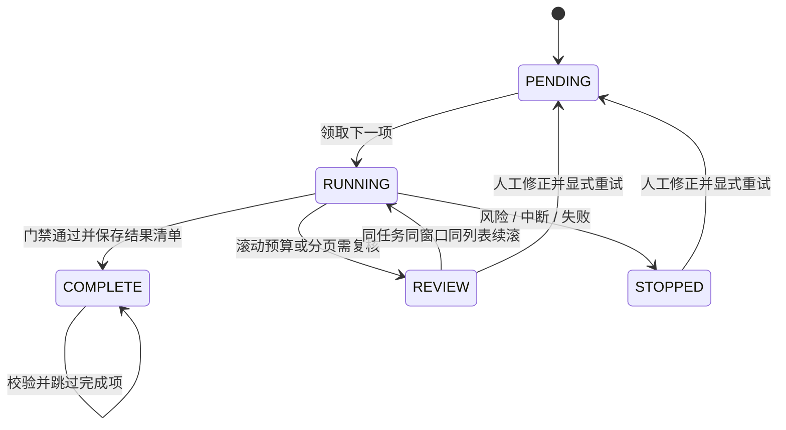

# 通用团购数据采集 Agent

[](https://github.com/cloudcollection/groupbuy-agent/actions/workflows/ci.yml)


面向所有使用者开放的团购数据采集工程。任何人都可以下载代码，在自己的电脑配置公开商家搜索任务、接入正常导出的本地响应，并获得可复核的精简数据。首个适配器为大众点评；其他平台尚未实现。默认不处理个人购买订单。

提供确定性的 Python 工具链，以及直接调用 OpenAI Responses API 的独立 Agent。独立入口运行时不依赖 Codex 或 MCP；模型选择工具，本地代码执行正常界面流程、校验和导出。真实模型模式使用操作者自己的 API Key；纯工具模式和虚构演示不需要密钥。请求层和核心均只用标准库，Windows UI 依赖可选安装。

**当前状态：0.3.0 / 实验阶段。** CLI 与本地网页共用独立 Agent；新增 Reqable 官方报告服务器接收器，首次配置后自动接收并保存脱敏 HAR。已通过虚构数据、本机 HTTP 与模拟界面的闭环验证。真实模型 API、本机小程序/Reqable 联动及其他电脑仍待验证。见 [CLI / UI 入门教程](docs/cli-ui-guide.md) 和 [验证状态](docs/validation.md)。

## 网页启动：配置、运行、查看进度

在 D 盘项目根目录执行：

```powershell
./setup.ps1 -WithUI
./start-ui.ps1
```

打开 `http://127.0.0.1:8787`，先点击「离线演示」体验无密钥、无联网的虚构流程。实际采集时保存任务、获取本机上传地址，在 Reqable「工具 → 报告服务器」配置一次目标平台规则，再填写模型与 API Key、允许界面操作并启动。每人使用自己的平台登录状态和 API Key。详细步骤见 [CLI / UI 教程](docs/cli-ui-guide.md)。

网页和 CLI 使用同一配置时会继续同一份进度；同一时间运行一个入口。网页不需要 Codex 或 MCP，密钥只用于运行内存。页面标签与窗口配置需要在每台电脑校准。

## 独立 Agent：无需 Codex

```text
任务配置 → 请求模型 → 模型选择本地工具 → 工具结果回传 → 下一轮
                         ↓
              界面操作 / 本地解析 / 校验 / 导出 / 进度
```

按下文设置 D 盘临时目录后，可先体验不联网的脚本演示。模型决策由程序模拟，真实解析与导出工具每次运行在隔离的虚构输出目录中：

```powershell
python -B -m groupbuy agent --demo
```

配置当前进程的 `OPENAI_API_KEY` 和 `OPENAI_MODEL` 后启动真实模型入口：

```powershell
python -B -m groupbuy --config config.local.json agent
# 本机界面校准后允许正常界面操作：
python -B -m groupbuy --config config.local.json agent --allow-ui
```

密钥的隐藏输入方法见 [Agent 安装步骤](docs/agent.md)。模型只接收不透明任务引用、状态、计数和错误码，原始数据及业务文本留在本机。自动配置使用 `input.kind=reqable`：终页后等待正常报告、校验完整分页、保存投影 HAR，再解析导出。人工 har/json 配置继续使用 WAITING_INPUT 流程。模型不能改配置、执行任意命令或跳过质量门禁。

| 工程能力 | 当前实现 |
|---|---|
| 独立模型循环 | 官方 Responses API、严格工具契约、串行回传、轮数与超时限制 |
| CLI / 网页 | 共用 Agent 与进度；本机 HTTP、CSRF、开始/停止/重试 |
| 自动 HAR | Reqable 官方报告服务器、本机接收、任务时间窗、落盘前公开字段投影 |
| 平台隔离 | `PlatformAdapter` 协议，当前仅注册 `dianping` |
| 任务隔离 | 任务编号 + 配置 SHA-256，拒绝复用含义变化的任务 |
| 分页完整性 | 最新搜索轮次、游标链、重复页检测、明确终页 |
| 数据边界 | `Shop` / `PublicProduct` 模型，字段投影、单位及原文保留 |
| 结果恢复 | 进程锁、原子 JSON、逐任务清单、文件 SHA-256 |
| 发布检查 | 精确白名单、提交前钩子、工作区/暂存区/全部可达历史扫描 |

## 系统架构



本地输入层没有 HTTP 请求客户端，不发送捕获的请求。界面动作和平台响应规则位于适配器中；通用运行器不包含界面坐标、平台字段或特定搜索地点。

```text
groupbuy/
├── config.py          # 配置校验、字段语义与任务哈希
├── agent.py           # 独立入口、脚本演示与前台定时
├── agent_runtime.py   # 模型请求、多轮工具回传和预算
├── agent_tools.py     # 状态摘要、环境检查、界面/解析工具
├── dashboard.py       # 本机网页接口与同一个 Agent
├── web/               # 无外部资源的网页界面
├── capture.py         # 官方报告接收、时间窗、不可覆盖 HAR 与恢复
├── runner.py          # 串行批次、锁、逐项事务、恢复
├── local_input.py     # HAR / JSON、时段、编码及体积限制
├── adapters/
│   ├── base.py        # PlatformAdapter 协议
│   ├── dianping.py    # 店铺/商品投影、轮次与分页
│   └── ui_flow.py     # 正常界面流程、终页与续段保护
├── windows_ui.py      # 当前窗口 OCR 定位和输入
├── models.py          # 公开业务模型
├── quality.py         # 任务、关联、溯源与安全门禁
├── privacy.py         # 递归清理及自由文本脱敏
├── exporter.py        # 精简导出、文件清单、批次合并
└── scheduler.py       # 北京时间时间槽与重复领取保护
tools/                 # 虚构样例生成、白名单暂存与敏感扫描
tests/                 # 合成业务、模拟界面、隔离 Git 仓库测试
```

任务配置 → 正常界面搜索与筛选 → 滚动至明确终页 → 读取本地导出 → 选择最后搜索轮次 → 完整分页 → 店铺及商品关联 → 脱敏与质量检查 → 精简导出 → 每项更新进度。

## 下载与开始使用

在 GitHub 点击 **Code → Download ZIP**，或克隆本仓库。Windows 用户解压到 D 盘，使用自己的微信、平台登录状态和本地输入，账号与采集数据保留在自己的电脑。共享的是代码、安装说明和虚构样例，没有公共采集账号或云端代采服务。

```powershell
git clone https://github.com/cloudcollection/groupbuy-agent.git
cd groupbuy-agent
```

第一次使用请按 [公开使用指南](docs/public-getting-started.md) 完成环境检查、虚构样例和一项真实任务校准。通过后再启用批量与定时运行。

## 快速试用虚构样例

将整个项目放在 D 盘，使用 Python 3.10+。核心只用标准库，不需要安装第三方包。先在项目根目录设置临时目录；如果已有统一的 D 盘临时目录，用环境变量 GB_TEMP_DIR 指向该目录。

```powershell
$env:GB_TEMP_DIR = Join-Path $PWD 'runtime/tmp'
New-Item -ItemType Directory -Force $env:GB_TEMP_DIR | Out-Null
$env:TEMP = $env:GB_TEMP_DIR
$env:TMP = $env:GB_TEMP_DIR
$env:PYTHONDONTWRITEBYTECODE = '1'
$env:PYTHONUTF8 = '1'
python -B -m groupbuy plan
python -B -m groupbuy run
python -B -m groupbuy run
python -B -m unittest discover -s tests -v
```

样例有 6 个虚构任务。第一批处理 5 个，第二批处理剩下 1 个；再次运行跳过已完成结果。每项生成 result.json（完整业务投影、溯源与质量报告）、compact.json、shops.csv、products.csv、manifest.json。默认输出位于 runtime/outputs；进度位于 runtime/progress.json。所有运行产物均被 Git 忽略。

JSON 保留字段原文和 null。CSV 空值为空格单元，不转换“100+”“79起”；可能被表格软件解释为公式的文本添加单引号。价格含独立单位字段，距离含搜索中心及来源，不自动推算未知坐标。

## 配置自己的采集任务

每位使用者使用自己的 config.local.json、输入目录和进度文件。不要共享账号、HAR、证书或 VPN 配置。如果多人协作，由团队统一分配任务编号，避免重复领取；单人使用不需要加入任何分工表。本版没有跨电脑自动派单或集中账号管理。

从 examples/config.live-template.json 复制配置，改成自己授权的公开商家任务；安装可选 UI 依赖用 `./setup.ps1 -WithUI`。配置不会替你登录或修改系统代理。

现场流程和恢复命令见 [使用说明](docs/usage.md)，字段和参数见 [配置说明](docs/configuration.md)，扩展平台见 [适配器说明](docs/adapters.md)。

## 运行状态与恢复语义



每项任务保存业务结果及文件清单后才更新进度。崩溃发生在清单保存后、进度更新前，下次运行可校验清单并恢复完成状态；未形成完整清单的目录保留，用新目录重跑。已完成结果不可覆盖，配置变化、文件缺失或哈希变化都会停止复用。

同一进度文件使用独占锁。定时器先领取北京时间时间槽，再执行批次，避免同一槽重复启动；崩溃后的时间槽不自动重领。单机执行串行，跨电脑任务分配由使用者管理。

## 质量门禁

采集次数、界面静止或返回记录数量都不能单独证明完成。写入 `COMPLETE` 前必须满足以下条件：

1. **查询与筛选一致**：UI 证据绑定任务哈希、搜索词、公开目标及已选筛选，确认字段必须是真正的布尔值。
2. **界面终页明确**：结果区域出现明确终页文字，等待后再次观察，加载已结束；产品标题中包含终页词不会被当成到底。
3. **分页完整**：从请求游标 `0` 沿 `nextStartIndex` 到布尔 `isEnd=true`；缺页、孤立页或不明游标回退均拒绝。
4. **轮次与重复页可解释**：选择最后搜索轮次；该轮不完整时不回退到旧轮。相同重复页去重，冲突重复页停止。
5. **关联与字段来源完整**：商品必须关联本任务店铺；每条业务记录有可解析的溯源编号。缺失店铺身份不会按店名拼接。
6. **安全检查通过**：只写入公开业务字段，自由文本先脱敏；日志只保存任务引用、状态、时间和受控错误码。

分段续滚要求原任务、窗口、尺寸及列表哈希一致，并保留原筛选证据。登录、验证码、访问限制、失焦或窗口变化都会停止批次；不能通过续跑绕过。

## 数据与溯源契约

| 模型 | 核心字段及口径 |
|---|---|
| `Shop` | 平台店铺 ID、完整分店名、类别、分类依据、评分、人均及单位、评价原文、商圈/地址、距离语义、采集时间、质量标记 |
| `PublicProduct` | 店铺关联、商品 ID、套餐/券类型、标题、售价/原价及单位、销量原文、可见规则、采集时间 |
| `PersonalPurchaseOrder` | 独立边界模型，实例化即拒绝；没有个人订单采集或导出功能 |

业务主键包含 `task_id` 和 `platform`。批次合并保留同一商家在不同任务下的观察，不跨搜索目标折叠记录。未知字段保持 `null`；缺商品 ID 不合成平台 ID。价格“起”、销量“+”和单位保留，不能把未标单位的数字自动解释为元。

距离值只有在响应明确给出搜索中心且与配置一致时才转换；原文、中心和来源一起保留。分类依据来自业务类别，餐饮、食品零售和待复核分别记录，不凭名称作结论。

`provenance_id` 指向来源文件 SHA-256、响应条目索引、页游标、字段路径和捕获时间。输出不包含原始 HAR、完整响应、请求 URL 或认证头。哈希用于完整性和误串任务防护，不是不可伪造的取证签名。

## 平台适配器接口

```python
class PlatformAdapter(Protocol):
    platform: str

    def collect_ui(self, task, runtime, driver, prior=None): ...
    def validate_evidence(self, task, evidence): ...
    def parse(self, task, entries, evidence): ...
```

添加平台时实现协议、登记适配器、提供虚构 schema 和对应测试，并说明实机验证状态。Windows 驱动在动作前验证当前窗口和画面，点击位置来自当前 OCR 文本框；列表区域由本机实际锚点确定。

当前大众点评适配器只解析公开搜索列表及其中的商品。尚未自动进入商家/商品详情，未出现的使用规则留空；自动 HAR 通过官方报告接收实现，首次 Reqable 配置和本机页面校准仍需操作者完成。其他平台适配器尚未实现。

## 批次与调度配置

以下为 `runtime` 和 `schedule` 的配置片段；完整模板见 `examples/`：

```json
{
  "runtime": {
    "batch_size": 5,
    "max_scrolls": 180,
    "wheel_steps": 10,
    "wait_seconds": [1, 2],
    "retry_limit": 2,
    "evidence_mode": "structured",
    "output_dir": "runtime/outputs",
    "progress_path": "runtime/progress.json"
  },
  "schedule": {
    "enabled": false,
    "timezone": "Asia/Shanghai",
    "times": ["09:00", "12:00", "15:00", "19:00"],
    "live_confirmed": false
  }
}
```

`retry_limit` 控制加载等待次数，不自动重试验证失败。定时器是本地前台进程，保持终端和电脑运行；错过时间槽不补跑，不会安装服务、自动登录或唤醒电脑。

## 测试与 CI

```powershell
python -B -m unittest discover -s tests -v
python -B tools/release_check.py
```

110 项测试覆盖独立模型工具循环、CLI/网页共享进度、自动报告 HTTP/gzip、任务与时段隔离、分页缺口、重复页冲突、轮次切换、关联、分类与单位、脱敏、停止/续滚/恢复、代理隔离、CSRF 和 Git 历史敏感检查。

本机 CLI 演示以 6 项虚构任务验证 `5 → 1 → 0` 的批次续跑，合并得到 12 条店铺观察和 12 条商品观察。GitHub Actions 在 push / pull request 上运行合成测试和发布扫描；CI 的执行状态由顶部徽章显示，不能代替真实页面校准。

## 发布准备

本地新仓库采用 publication-files.json 精确白名单、.gitignore 和 .githooks/pre-commit。先运行 `python -B tools/prepare_index.py`，再运行 `python -B tools/release_check.py`。扫描包含未提交工作文件、暂存内容和所有可达 Git 提交；日志只输出问题类型和文件路径。

扫描不能证明业务文件绝对无敏感信息，发布前仍应人工检查白名单和虚构样例来源。任何真实任务、响应、结果和日志都不能进入白名单。维护者发布步骤见 [发布检查说明](docs/publication.md)。采集命令不会自动上传任务或数据。

许可：GPL-3.0-only，来源说明见 NOTICE.md。
